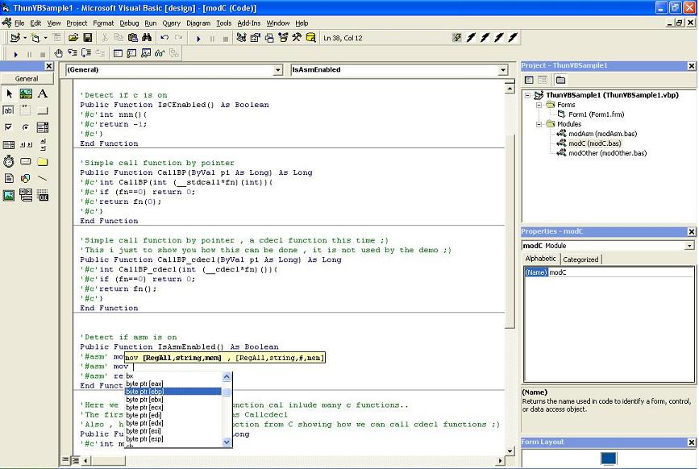



## ThunderVB \- Beta 1

### Description

ThunderVB is a Addin for Visual Basic 6 sp6 that adds

Inline Asm/C , non ActiveX Dll creation , Asm and C

code coloring and Asm Code completion on the VB ide.

This is some outdated code that was released as a

"public beta test".

Expect a new release soon..

The ThunderVB development team [ Raziel and Libor].
 
### More Info
 

             |
---                |---
**Submitted On**   |2004-11-03 12:49:56
**By**             |[ThunderVB development Team](https://github.com/Planet-Source-Code/PSCIndex/blob/master/ByAuthor/thundervb-development-team.md)
**Level**          |Advanced
**User Rating**    |4.9 (79 globes from 16 users)
**Compatibility**  |VB 6\.0
**Category**       |[VB function enhancement](https://github.com/Planet-Source-Code/PSCIndex/blob/master/ByCategory/vb-function-enhancement__1-25.md)
**World**          |[Visual Basic](https://github.com/Planet-Source-Code/PSCIndex/blob/master/ByWorld/visual-basic.md)
**Archive File**   |[ThunderVB\_1841591192005\.zip](https://github.com/Planet-Source-Code/thundervb-development-team-thundervb-beta-1__1-58365/archive/master.zip)

